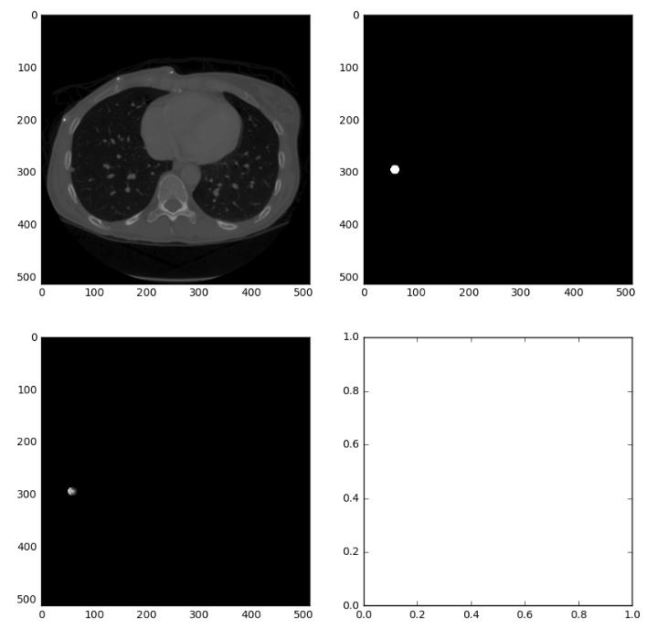
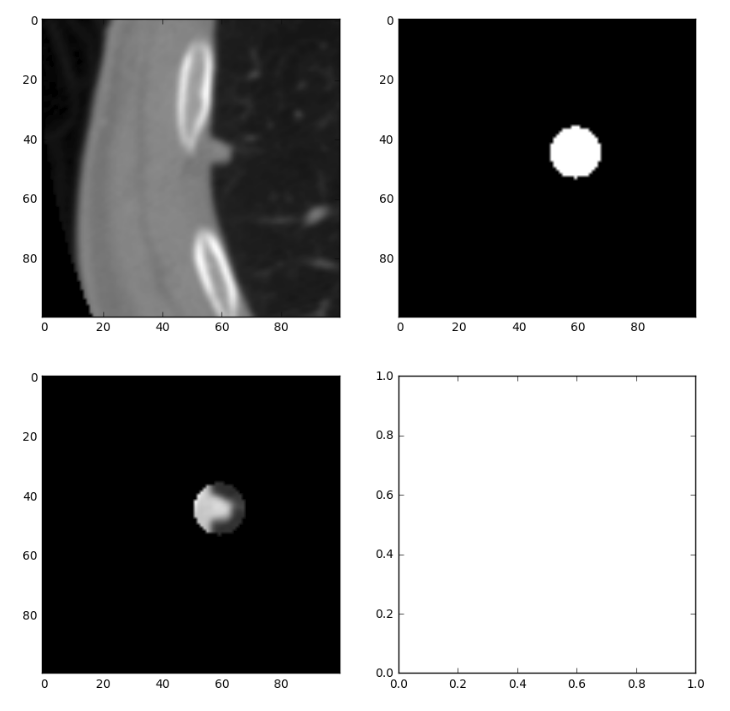
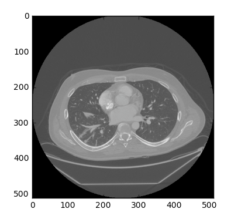
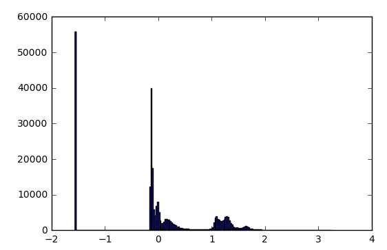
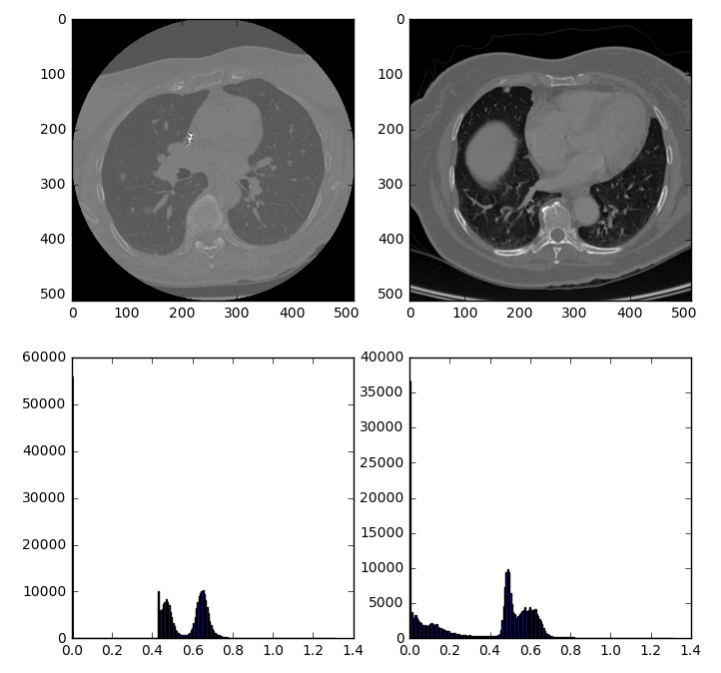
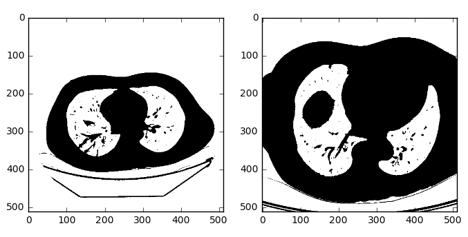
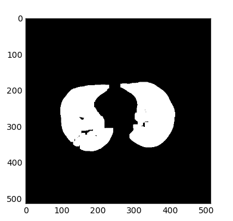
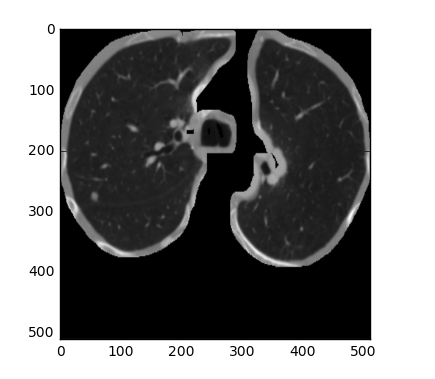
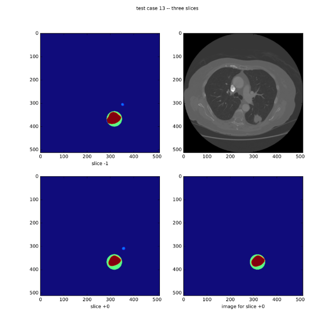
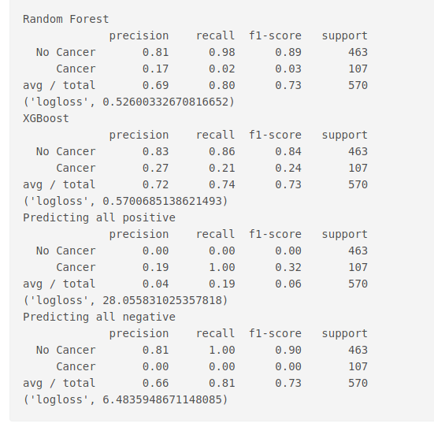

## 使用U-Net分割方法进行癌症诊断

written by Jonathan Mulholland and Aaron Sander, Booz Allen Hamilton

在本教程中，我们将展示一种方法来根据患者的CT扫描图像来判断患者是否患有癌症或者可能在未来12个月内发展成癌症患者。

我们将训练一个网络来分割出潜在的癌性结节，然后使用这些分割出的结点的特征来对CT扫描病人未来12个月的病情诊断进行预测。

教程代码位于[这里]( https://github.com/booz-allen-hamilton/DSB3Tutorial)

### 依赖和工具
* numpy
* scikit-image
* scikit-learn
* keras (tensorflow backend)
* matplotlib
* pydicom
* SimpleITK

注意：Keras训练允许使用多种backend。我们选择安装支持GPU的tensorflow作为Keras的backend。（keras可以选择tensorflow或者theano作为keras的backend，因为keras的框架有基于tensorflow的版本和theano的版本）。

为了识别具有结节的区域，我们将使用[U-Net](https://arxiv.org/abs/1505.04597)风格的卷积网络，这个网络主要用于做分割。点击打开链接

我们的网络代码是基于MarkoJocic在Kaggle论坛上为[UltrasoundNerve Segmentation](https://www.kaggle.com/c/ultrasound-nerve-segmentation/forums/t/21358/0-57-deep-learning-keras-tutorial)挑战发布的教程。

我们用于预测癌症诊断的图像是（CT）扫描图像。CT扫描中结节的外观暗含了患者患有癌症的可能性的信息，我们将需要通过训练标记好的结节的样例来训练U-net神经网络，再通过训练好的网络来寻找结节。我们不采用手动标记图像，而选择LungNodule Analysis 2016 (LUNA2016) challenge中提供的标记好了结节位置的CT图像。我们将首先使用LUNA数据集为我们的U-Net生成适当的训练集。我们将使用这些训练集来训练我们的有监督分割器。

### 从LUNA2016数据构建训练集
我们将使用annotations.csv中给出的结节位置，并从每个病人扫描中提取包含最大结节的三个横切片。将根据annotations.csv中给出的结节尺寸为这些切片创建掩码。该文件的输出将是每个病人扫描的两个文件：一组图像和一组相应的结节掩模。来自LUNA2016挑战的数据可以在这里找到点击打开链接

首先我们导入必要的工具，并在病人的CT扫描中找到最大的结节。一些患者在annotations.csv中有多个结节。我们使用名为df_node的DataFrame（pandas中的数据结构）来跟踪病例编号和节点信息。这些节点信息是后缀为.mhd文件中定义的坐标系的（x，y，z）坐标（mm）。

以下代码片段来自LUNA_mask_extraction.py：
```
import SimpleITK as sitk
import numpy as np
import csv
from glob import glob
import pandas as pd
file_list=glob(luna_subset_path+"*.mhd")

#Helper function to get rows in data frame associated 
#with each file
def get_filename(case):
    global file_list
    for f in file_list:
        if case in f:
            return(f)

#The locations of the nodes
df_node = pd.read_csv(luna_path+"annotations.csv")
df_node["file"] = df_node["seriesuid"].apply(get_filename)
df_node = df_node.dropna()

#Looping over the image files
fcount = 0
for img_file in file_list:
    print "Getting mask for image file %s" % img_file.replace(luna_subset_path,"")
    mini_df = df_node[df_node["file"]==img_file] #get all nodules associate with file
    if len(mini_df)>0:       # some files may not have a nodule--skipping those 
        biggest_node = np.argsort(mini_df["diameter_mm"].values)[-1]   # just using the biggest node
        node_x = mini_df["coordX"].values[biggest_node]
        node_y = mini_df["coordY"].values[biggest_node]
        node_z = mini_df["coordZ"].values[biggest_node]
        diam = mini_df["diameter_mm"].values[biggest_node]
```

### 在mhd文件中获取结节位置
结节的位置相对于由CT扫描仪定义的以毫米为单位的坐标系。图像数据数由不同长度的大小为512×512的array构成。为了将体素位置转换为世界坐标系，我们需要知道[0,0,0]体素的真实坐标和体素的间距（mm）。

为了找到一个结节的体素坐标，根据其真实的位置，我们使用itk图像对象的GetOrigin()和GetSpacing()方法：
```
itk_img = sitk.ReadImage(img_file) 
img_array = sitk.GetArrayFromImage(itk_img) # indexes are z,y,x (notice the ordering)
center = np.array([node_x,node_y,node_z])   # nodule center
origin = np.array(itk_img.GetOrigin())      # x,y,z  Origin in world coordinates (mm)
spacing = np.array(itk_img.GetSpacing())    # spacing of voxels in world coor. (mm)
v_center =np.rint((center-origin)/spacing)  # nodule center in voxel space (still x,y,z ordering)
```

结节的中心位于img_array的v_center[2]切片中。我们将节点信息传递给make_mask（）函数，并复制生成的掩码给v_center[2]切片图像以及其上方和下方的切片图像。
```
i = 0
for i_z in range(int(v_center[2])-1,int(v_center[2])+2):
    mask = make_mask(center,diam,i_z*spacing[2]+origin[2],width,height,spacing,origin)
    masks[i] = mask
    imgs[i] = matrix2int16(img_array[i_z])
    i+=1
np.save(output_path+"images_%d.npy" % (fcount) ,imgs)
np.save(output_path+"masks_%d.npy" % (fcount) ,masks)
```

值得注意的是，在make_mask()函数中，掩码坐标必须与array的坐标的顺序相匹配。x和y排序被翻转。请参阅下面代码中的最后一行的下一个代码：
   ```
    def make_mask(center,diam,z,width,height,spacing,origin):
    ...
    for v_x in v_xrange:
        for v_y in v_yrange:
            p_x = spacing[0]*v_x + origin[0]
            p_y = spacing[1]*v_y + origin[1]
            if np.linalg.norm(center-np.array([p_x,p_y,z]))<=diam:
                mask[int((p_y-origin[1])/spacing[1]),int((p_x-origin[0])/spacing[0])] = 1.0
    return(mask)
```

我们应该在每次扫描中收集更多的切片吗？

由于结节位置是根据球体定义的，并且结节是不规则形状的，球体边缘附近的切片可能不含结节组织。使用这样的切片可能产生假阳性导致污染训练集。对于这个分割任务，可能存在一个最优的包含的切片的数量。但是为了简单起见，我们只取3张切片，只选择最大的靠近结节中心的切片。

检查以确保结节mask如我们所预期一样：

```
import matplotlib.pyplot as plt
imgs = np.load(output_path+'images_0.npy')
masks = np.load(output_path+'masks_0.npy')
for i in range(len(imgs)):
    print "image %d" % i
    fig,ax = plt.subplots(2,2,figsize=[8,8])
    ax[0,0].imshow(imgs[i],cmap='gray')
    ax[0,1].imshow(masks[i],cmap='gray')
    ax[1,0].imshow(imgs[i]*masks[i],cmap='gray')
    plt.show()
    raw_input("hit enter to cont : ")
    
```

结节的中心位于img_array的v_center[2]切片中。我们将节点信息传递给make_mask（）函数，并复制生成的掩码给v_center[2]切片图像以及其上方和下方的切片图像。
左上角的图像是扫描切片。 右上角的图像是节点掩码（mask）。左下角的图像是掩码切片，突出显示了结节。



结节的近景图像




### 提取肺部感兴趣区域以缩小我们的结节搜索

节点掩码似乎已经被正确构建出来了。下一步是提取图像中的肺部区域。我们需要为此步骤导入一些skimage图像处理模块。总体策略是阈值化图像以区分出图像中的各个区域，然后识别哪些区域是肺部。肺与周围组织有较高的对比，因此阈值相当简单。我们使用一些临时的策略来从图像中消除非肺部区域，这些策略不适用于所有数据集。

导入库
```
from skimage import morphology
from skimage import measure
from sklearn.cluster import KMeans
from skimage.transform import resize
```

这些步骤可以在LUNA_segment_lung_ROI.py中找到
数组被加载为dtype= np.float64的格式，因为在Sklearn中的KMeans对于这种精度的数据输入存在一个bug。
我们将逐步介绍使用img提取肺部ROI的步骤，img是我们通过LUNA2016的数据提取成的切片集合中的一张512×512的切片，它看起来大概类似于下图：





### 二值化
我们的第一步是标准化像素值并查看亮度分布
```
img = imgs_to_process[i]
#Standardize the pixel values
mean = np.mean(img)
std = np.std(img)
img = img-mean
img = img/std
plt.hist(img.flatten(),bins=200)
```



-1.5附近的下溢峰值是图像的黑色扫描仪外部部分。0.0左右的峰值是背景和肺内部，1.0至2.0的大团块是非肺组织和骨骼。该直方图的结构在整个数据集中是不同的。下面显示了两个数据集的典型图像。左边的图与img类似，在灰色的圆形区域中存在相同的黑色背景。右边的图像中不存在黑色背景，因此它们的像素值直方图差别很大。




我们必须确保我们设置的阈值能够通过像素值区分肺和密度更高的组织。 为此，我们将最小值的像素重置为图像中心附近的平均像素值，并使用k = 2执行kmeans聚类。 效果似乎不错。
```
middle = img[100:400,100:400] 
mean = np.mean(middle)  
max = np.max(img)
min = np.min(img)
#move the underflow bins
img[img==max]=mean
img[img==min]=mean
kmeans = KMeans(n_clusters=2).fit(np.reshape(middle,[np.prod(middle.shape),1]))
centers = sorted(kmeans.cluster_centers_.flatten())
threshold = np.mean(centers)
thresh_img = np.where(img<threshold,1.0,0.0)  # threshold the image
```

这种方法很好地分离了了两种类型的图像区域，并消除了左侧的黑色光晕




### 腐蚀和膨胀
然后，我们使用腐蚀和膨胀来填平（消除）由不透明射线造成的黑色肺部区域，然后根据每个区域的边界框大小选择区域。 初始的区域集合大概如下图所示
```
eroded = morphology.erosion(thresh_img,np.ones([4,4]))
dilation = morphology.dilation(eroded,np.ones([10,10]))
labels = measure.label(dilation)
label_vals = np.unique(labels)
plt.imshow(labels)
```

### 切割非ROI区域
根据经验确定每个区域边界框的切割，对于LUNA数据似乎效果很好，但可能不具有普遍性
```
labels = measure.label(dilation)
label_vals = np.unique(labels)
regions = measure.regionprops(labels)
good_labels = []
for prop in regions:
    B = prop.bbox
    if B[2]-B[0]<475 and B[3]-B[1]<475 and B[0]>40 and B[2]<472:
        good_labels.append(prop.label)
mask = np.ndarray([512,512],dtype=np.int8)
mask[:] = 0
#
#The mask here is the mask for the lungs--not the nodes
#After just the lungs are left, we do another large dilation
#in order to fill in and out the lung mask 
#
for N in good_labels:
    mask = mask + np.where(labels==N,1,0)
mask = morphology.dilation(mask,np.ones([10,10])) # one last dilation
plt.imshow(mask,cmap='gray')
```



### 使用ROI掩膜（mask）
LUNA_segment_lung_ROI.py中的下一步是将肺部的ROI掩码应用于每个图像，裁剪到肺ROI的边界方框，然后将生成的图像调整大小为512×512。

```
masks = np.load(working_path+"lungmask_0.py")
imgs = np.load(working_path+"images_0.py")
imgs = masks*imgs
```

裁剪到边界，并调整大小为512×512。

然后我们将对像素进行归一化。 这是因为掩码将图像中的非ROI区域设置为0，并且该操作对像素值分布不敏感。 为了解决这个问题，我们计算掩膜区域的平均值和标准差，并将背景的像素值（现在为零）设置为到像素分布中的较低值（-1.2 * stdev，这是经验选择的）。（译者注：个人理解是之前的 操作使得非ROI区域，即背景区域的像素值为0，这样不合适，因此我们将背景区域设置为一个比较低的像素值，这样既能使背景区域像素值非0，也保证了它足够小）


```
#renormalizing the masked image (in the mask region)

new_mean = np.mean(img[mask>0])  
new_std = np.std(img[mask>0])

#Pushing the background color up to the lower end
#of the pixel range for the lungs
old_min = np.min(img)       # background color
img[img==old_min] = new_mean-1.2*new_std   # resetting backgound color
img = img-new_mean
img = img/new_std
```

最终结果是一系列可以作为训练样本的肺部图片。



这些图像和相应的修剪和重新调整的掩码被随机打乱传递到一个numpy数组文件中，该数组文件的维数为[<num_images>,1,512,512]。 由于U-net使用多通道，所以前面的1是必须的。

```
#Writing out images and masks as 1 channel arrays for input into network
final_images = np.ndarray([num_images,1,512,512],dtype=np.float32)
final_masks = np.ndarray([num_images,1,512,512],dtype=np.float32)
for i in range(num_images):
    final_images[i,0] = out_images[i]
    final_masks[i,0] = out_nodemasks[i]
rand_i = np.random.choice(range(num_images),size=num_images,replace=False)
test_i = int(0.2*num_images)
np.save(working_path+"trainImages.npy",final_images[rand_i[test_i:]])
np.save(working_path+"trainMasks.npy",final_masks[rand_i[test_i:]])
np.save(working_path+"testImages.npy",final_images[rand_i[:test_i]])
np.save(working_path+"testMasks.npy",final_masks[rand_i[:test_i]])
```

您可以通过查看肺部掩膜与和原始文件来验证ROI分割的效果：
```
imgs = np.load(working path+'images_0.npy')
lungmask = np.load(working_path+'lungmask_0.npy')
for i in range(len(imgs)):
    print "image %d" % i
    fig,ax = plt.subplots(2,2,figsize=[8,8])
    ax[0,0].imshow(imgs[i],cmap='gray')
    ax[0,1].imshow(lungmask[i],cmap='gray')
    ax[1,0].imshow(imgs[i]*lungmask[i],cmap='gray')
    plt.show()
    raw_input("hit enter to cont : ")
```

### Dice系数作为分割的成本函数
我们将要使用的网络是教程开端提到的U-net，使用的是keras框架来构建。 损失函数是Dice系数，链接点击打开链接比较了预测和实际的节点掩膜。

以下代码片段全部取自LUNA_train_unet.py

损失函数如下：
```
smooth = 1.
#Tensorflow version for the model
def dice_coef(y_true, y_pred):
    y_true_f = K.flatten(y_true)
    y_pred_f = K.flatten(y_pred)
    intersection = K.sum(y_true_f * y_pred_f)
    return (2. * intersection + smooth) / (K.sum(y_true_f) + K.sum(y_pred_f) + smooth)
def dice_coef_loss(y_true, y_pred):
    return -dice_coef(y_true, y_pred)
    
```

该损失函数类似于用于评估该网络最初编写的超声神经分割挑战的度量（再次参见本教程开头的链接）。

### 载入分割器
函数调用命令
```
model = get_unet() 
model_checkpoint = ModelCheckpoint('unet.hdf5', monitor='loss', save_best_only=True)
```

将编译并返回模型，并告诉keras在checkpoints保存模型的权重。 如果您想从以前的训练结果加载最佳权重，或使用本教程回购中包含的权重，请使用下面这行命令加载权重文件
```
model.load_weights('unet.hdf5')
```

### 训练分割器
从命令行调用LUNA_train_unet.py系统将尝试从当前目录加载一个unet.hdf5文件，并在脚本中根据下面这行命令设置的参数进行训练并测试。
```
model.fit(imgs_train, imgs_mask_train, batch_size=2, nb_epoch=20, 
           verbose=1, shuffle=True,callbacks=[model_checkpoint])
```

测试代码如下
```
num_test = len(imgs_test)
imgs_mask_test = np.ndarray([num_test,1,512,512],dtype=np.float32)
for i in range(num_test):
    imgs_mask_test[i] = model.predict([imgs_test[i:i+1]], verbose=0)[0]
np.save('masksTestPredicted.npy', imgs_mask_test)
mean = 0.0
for i in range(num_test):
    mean+=dice_coef_np(imgs_mask_test_true[i,0], imgs_mask_test[i,0])
mean/=num_test
print("Mean Dice Coeff : ",mean)
```

model.predict()函数操作一次可以测试多个样本，但因为我们可以快速重载GPU，我们循环测试各个样本。

本教程的最终结果是通过GPU机器，使用TitanX训练得到的。 对于家用GPU计算基准测试，个人设置了GTX970，我们可以在大约一个小时内运行20个epoch，训练集大小为320，批量大小为2。 我们开始约3个小时的训练后，我们就开始得到相对合理的结节掩膜预测结果，损失值大约0.3 。

这里给出了从患者扫描获取的三个切片的一个分割示例。 完整的圆是来自LUNA annotationc.csv文件的“真实”节点掩膜，红色是分割器的预测节点区域。 原始图像在右上方给出。



### 训练一个识别癌症的分类器
现在，我们已经准备好开始使用我们上一节中的图像分割来训练分类器以生成特征。

The Data Science Bowl训练数据集必须被放到分割器进行分割，这可以通过重用用于处理LUNA数据的代码来完成。 但是存在两点区别：

首先，DSB数据采用dicom格式，可以使用pydicom模块进行读取
```
import dicom
dc = dicom.read_file(filename)
img = dc.pixel_array
```

其次，为了在扫描中定位节点，扫描的每一层都必须通过分割器运行，因此每个层也必须进行图像处理以对ROI进行掩膜运算。 这是一个非常耗时的过程。

### 基于结节特征的简单分类器
我们首先描述结节图的一些特征，并将它们放入特征向量中，这些特征向量可以用于分类。 我们选取特征并不详尽，它的目的在于说明如何发现可用于识别结节所在区域的度量。

我们希望您可以添加一些新功能，探索卷积模型，直接从感兴趣的区域提取特征。 我们已经包括了一些关于图像中的平均尺寸，形态和位置的特征，用于建模。
```
def getRegionMetricRow(fname = "nodules.npy"):
    seg = np.load(fname)
    nslices = seg.shape[0]
    #metrics
    totalArea = 0.
    avgArea = 0.
    maxArea = 0.
    avgEcc = 0.
    avgEquivlentDiameter = 0.
    stdEquivlentDiameter = 0.
    weightedX = 0.
    weightedY = 0.
    numNodes = 0.
    numNodesperSlice = 0.
    # do not allow any nodes to be larger than 10% of the pixels to eliminate background regions
    maxAllowedArea = 0.10 * 512 * 512 
    areas = []
    eqDiameters = []
    for slicen in range(nslices):
        regions = getRegionFromMap(seg[slicen,0,:,:])
        for region in regions:
            if region.area > maxAllowedArea:
                continue
            totalArea += region.area
            areas.append(region.area)
            avgEcc += region.eccentricity
            avgEquivlentDiameter += region.equivalent_diameter
            eqDiameters.append(region.equivalent_diameter)
            weightedX += region.centroid[0]*region.area
            weightedY += region.centroid[1]*region.area
            numNodes += 1
    weightedX = weightedX / totalArea 
    weightedY = weightedY / totalArea
    avgArea = totalArea / numNodes
    avgEcc = avgEcc / numNodes
    avgEquivlentDiameter = avgEquivlentDiameter / numNodes
    stdEquivlentDiameter = np.std(eqDiameters)
    maxArea = max(areas)
    numNodesperSlice = numNodes*1. / nslices
    return np.array([avgArea,maxArea,avgEcc,avgEquivlentDiameter,\
                     stdEquivlentDiameter, weightedX, weightedY, numNodes, numNodesperSlice])
def getRegionFromMap(slice_npy):
    thr = np.where(slice_npy > np.mean(slice_npy),0.,1.0)
    label_image = label(thr)
    labels = label_image.astype(int)
    regions = regionprops(labels)
    return regions
import pickle
def createFeatureDataset(nodfiles=None):
    if nodfiles == None:
        noddir = "nodulesdir/"
        nodfiles = glob(noddir +"*npy")
    # dict with mapping between truth and 
    truthdata = pickle.load(open("truthdict.pkl",'r'))
    numfeatures = 9
    feature_array = np.zeros((len(nodfiles),numfeatures))
    truth_metric = np.zeros((len(nodfiles)))
    for i,nodfile in enumerate(nodfiles):
        patID = nodfile.split("_")[2]
        truth_metric[i] = truthdata[int(patID)]
        feature_array[i] = getRegionMetricRow(nodfile)
    np.save("dataY.npy", truth_metric)
    np.save("dataX.npy", feature_array)
```

一旦我们创建了特征向量，我们将它们加载到一些简单的分类模型中，看看实验结果。 我们选择随机森林和XGBoost基于我们的特征工程创建一些模型。
```
from sklearn import cross_validation
from sklearn.cross_validation import StratifiedKFold as KFold
from sklearn.metrics import classification_report
from sklearn.ensemble import RandomForestClassifier as RF
import xgboost as xgb
X = np.load("dataX.npy")
Y = np.load("dataY.npy")
#Random Forest
kf = KFold(Y, n_folds=3)
y_pred = Y * 0
y_pred_prob = Y * 0
for train, test in kf:
    X_train, X_test, y_train, y_test = X[train,:], X[test,:], Y[train], Y[test]
    clf = RF(n_estimators=100, n_jobs=3)
    clf.fit(X_train, y_train)
    y_pred[test] = clf.predict(X_test)
    y_pred_prob[test] = clf.predict_proba(X_test)[:,1]
print ('Random Forest')
print classification_report(Y, y_pred, target_names=["No Cancer", "Cancer"])
print("logloss",logloss(Y, y_pred_prob))
#XGBoost
print ("XGBoost")
kf = KFold(Y, n_folds=3)
y_pred = Y * 0
y_pred_prob = Y * 0
for train, test in kf:
    X_train, X_test, y_train, y_test = X[train,:], X[test,:], Y[train], Y[test]
    clf = xgb.XGBClassifier(objective="binary:logistic", scale_pos_weight=3 )
    clf.fit(X_train, y_train)
    y_pred[test] = clf.predict(X_test)
    y_pred_prob[test] = clf.predict_proba(X_test)[:,1]
print classification_report(Y, y_pred, target_names=["No Cancer", "Cancer"])
print("logloss",logloss(Y, y_pred_prob))
#All Cancer
print "Predicting all positive"
y_pred = np.ones(Y.shape)
print classification_report(Y, y_pred, target_names=["No Cancer", "Cancer"])
print("logloss",logloss(Y, y_pred))
#No Cancer
print "Predicting all negative"
y_pred = Y*0
print classification_report(Y, y_pred, target_names=["No Cancer", "Cancer"])
print("logloss",logloss(Y, y_pred))
```

建模效果如下：



### 下一步如何改进？
我们为您提供了一个解决这个问题的框架，将基于深度学习的分割方法与旧的计算机视觉方法结合在一起。 根据这些内容您可以通过更多数据或其他预处理方法来改进u-net模型。 分类片段可以由另一个卷积网络替代，我们普遍将图像作为独立的2D切片来处理，或许您可以考虑更多地利用结节的3d性质。
